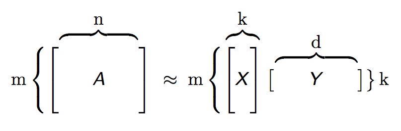

# Generalized Low Rank Models
- Overview
- What is a Low Rank Model?
- Why use Low Rank Models?
	- Memory
	- Speed
	- Feature Engineering
	- Missing Data Imputation
- Example 1: Visualizing Walking Stances
	- Basic Model Building
	- Plotting Archetypal Features
	- Imputing Missing Values
- Example 2: Compressing Zip Codes
	- Condensing Categorical Data
	- Runtime and Accuracy Comparison
- References

## Overview

This tutorial introduces the Generalized Low Rank Model (GLRM) [[1](#references)], a new machine learning approach for reconstructing missing values and identifying important features in heterogeneous data. It demonstrates how to build a GLRM in H2O and integrate it into a data science pipeline to make better predictions.

## What is a Low Rank Model?

Across business and research, analysts seek to understand large collections of data with numeric and categorical values. Many entries in this table may be noisy or even missing altogether. Low rank models facilitate the understanding of tabular data by producing a condensed vector representation for every row and column in the data set.

Specifically, given a data table A with m rows and n columns, a GLRM consists of a decomposition of A into numeric matrices X and Y. The matrix X has the same number of rows as A, but only a small, user-specified number of columns k. The matrix Y has k rows and d columns, where d is equal to the total dimension of the embedded features in A. For example, if A has 4 numeric columns and 1 categorical column with 3 distinct levels (e.g., _red_, _blue_ and _green_), then Y will have 7 columns. When A contains only numeric features, the number of columns in A and Y are identical, as shown below.

Both X and Y have practical interpretations. Each row of Y is an archetypal feature formed from the columns of A, and each row of X corresponds to a row of A projected into this reduced dimension feature space. We can approximately reconstruct A from the matrix product XY, which has rank k. The number k is chosen to be much less than both m and n: a typical value for 1 million rows and 2,000 columns of numeric data is k = 15. The smaller k is, the more compression we gain from our low rank representation.

GLRMs are an extension of well-known matrix factorization methods such as Principal Components Analysis (PCA). While PCA is limited to numeric data, GLRMs can handle mixed numeric, categorical, ordinal and Boolean data with an arbitrary number of missing values. It allows the user to apply regularization to X and Y, imposing restrictions like non-negativity appropriate to a particular data science context. Thus, it is an extremely flexible approach for analyzing and interpreting heterogeneous data sets.

## Why use Low Rank Models?

- **Memory:** By saving only the X and Y matrices, we can significantly reduce the amount of memory required to store a large data set. A file that is 10 GB can be compressed down to 100 MB. When we need the original data again, we can reconstruct it on the fly from X and Y with minimal loss in accuracy.
- **Speed:** We can use GLRM to compress data with high-dimensional, heterogeneous features into a few numeric columns. This leads to a huge speed-up in model building and prediction, especially by machine learning algorithms that scale poorly with the size of the feature space. Below, we will see an example with 10x speed-up and no accuracy loss in deep learning.
- **Feature Engineering:** The Y matrix represents the most important combination of features from the training data. These condensed features, called archetypes, can be analyzed, visualized and incorporated into various data science applications. 
- **Missing Data Imputation:** Reconstructing a data set from X and Y will automatically impute missing values. This imputation is accomplished by intelligently leveraging the information contained in the known values of each feature, as well as user-provided parameters such as the loss function.

## Example 1: Visualizing Walking Stances

For our first example, we will use data on [Subject 01's walking stances](https://simtk.org/project/xml/downloads.xml?group_id=603) from an experiment carried out by _Hamner and Delp (2013)_ [[2](#references)]. Each of the 151 rows of the data set contains the (x, y, z) coordinates of major body parts recorded at a specific point in time.

#### Basic Model Building

###### Initialize the H2O server and import our walking stance data. We use all available cores on our computer and allocate a maximum of 2 GB of memory to H2O.
	library(h2o)
	h2o.init(nthreads = -1, max_mem_size = "2G")
	gait.hex <- h2o.importFile(path = normalizePath("../data/subject01_walk1.csv"), destination_frame = "gait.hex")

###### Get a summary of the imported data set.
	dim(gait.hex)
	summary(gait.hex)

###### Build a basic GLRM using quadratic loss and no regularization. Since this data set contains only numeric features and no missing values, this is equivalent to PCA. We skip the first column since it is the time index, set the rank k = 10, and allow the algorithm to run for a maximum of 1,000 iterations.
	gait.glrm <- h2o.glrm(training_frame = gait.hex, cols = 2:ncol(gait.hex), k = 10, loss = "Quadratic", 
	                      regularization_x = "None", regularization_y = "None", max_iterations = 1000)

###### To ensure our algorithm converged, we should always plot the objective function value per iteration after model building is complete.
	plot(gait.glrm)

#### Plotting Archetypal Features

###### The rows of the Y matrix represent the principal stances that Subject 01 took while walking. We can visualize each of the 10 stances by plotting the (x, y) coordinate weights of each body part.
	gait.y <- gait.glrm@model$archetypes
	gait.y.mat <- as.matrix(gait.y)
	x_coords <- seq(1, ncol(gait.y), by = 3)
	y_coords <- seq(2, ncol(gait.y), by = 3)
	feat_nams <- sapply(colnames(gait.y), function(nam) { substr(nam, 1, nchar(nam)-1) })
	feat_nams <- as.character(feat_nams[x_coords])
	for(k in 1:10) {
		plot(gait.y.mat[k,x_coords], gait.y.mat[k,y_coords], xlab = "X-Coordinate Weight", ylab = "Y-Coordinate Weight", main = paste("Feature Weights of Archetype", k), col = "blue", pch = 19, lty = "solid")
		text(gait.y.mat[k,x_coords], gait.y.mat[k,y_coords], labels = feat_nams, cex = 0.7, pos = 3)
		cat("Press [Enter] to continue")
		line <- readline()
	}

###### The rows of the X matrix decompose each bodily position Subject 01 took at a specific time into a combination of the principal stances. Let's plot each principal stance over time to see how they alternate.
	gait.x <- h2o.getFrame(gait.glrm@model$representation_name)
	time.df <- as.data.frame(gait.hex$Time[1:150])[,1]
	gait.x.df <- as.data.frame(gait.x[1:150,])
	matplot(time.df, gait.x.df, xlab = "Time", ylab = "Archetypal Projection", main = "Archetypes over Time", type = "l", lty = 1, col = 1:5)
	legend("topright", legend = colnames(gait.x.df), col = 1:5, pch = 1)

###### We can reconstruct our original training data from X and Y.
	gait.pred <- predict(gait.glrm, gait.hex)
	head(gait.pred)

###### For comparison, let's plot the original and reconstructed data of a specific feature over time: the x-coordinate of the left acromium.
	lacro.df <- as.data.frame(gait.hex$L.Acromium.X[1:150])
	lacro.pred.df <- as.data.frame(gait.pred$reconstr_L.Acromium.X[1:150])
	matplot(time.df, cbind(lacro.df, lacro.pred.df), xlab = "Time", ylab = "X-Coordinate of Left Acromium", main = "Position of Left Acromium over Time", type = "l", lty = 1, col = c(1,4))
	legend("topright", legend = c("Original", "Reconstructed"), col = c(1,4), pch = 1)

#### Imputing Missing Values

Suppose that due to a sensor malfunction, our walking stance data has missing values randomly interspersed. We can use GLRM to reconstruct these missing values from the existing data.

###### Import walking stance data containing 15% missing values and get a summary.
	gait.miss <- h2o.importFile(path = normalizePath("../data/subject01_walk1_miss15.csv"), destination_frame = "gait.miss")
	dim(gait.miss)
	summary(gait.miss)

###### Count the total number of missing values in the data set.
	sum(is.na(gait.miss))

###### Build a basic GLRM with quadratic loss and no regularization, validating on our original data set that has no missing values. We change the algorithm initialization method, increase the maximum number of iterations to 2,000, and reduce the minimum step size to 1e-6 to ensure convergence.
	gait.glrm2 <- h2o.glrm(training_frame = gait.miss, validation_frame = gait.hex, cols = 2:ncol(gait.miss), k = 10, init = "SVD", svd_method = "GramSVD",
	                      loss = "Quadratic", regularization_x = "None", regularization_y = "None", max_iterations = 2000, min_step_size = 1e-6)
	plot(gait.glrm2)

###### Impute missing values in our training data from X and Y.
	gait.pred2 <- predict(gait.glrm2, gait.miss)
	head(gait.pred2)
	sum(is.na(gait.pred2))

###### Plot the original and reconstructed values of the x-coordinate of the left acromium. Red x's mark the points where the training data contains a missing value, so we can see how accurate our imputation is.
	lacro.pred.df2 <- as.data.frame(gait.pred2$reconstr_L.Acromium.X[1:150])
	matplot(time.df, cbind(lacro.df, lacro.pred.df2), xlab = "Time", ylab = "X-Coordinate of Left Acromium", main = "Position of Left Acromium over Time", type = "l", lty = 1, col = c(1,4))
	legend("topright", legend = c("Original", "Imputed"), col = c(1,4), pch = 1)
	lacro.miss.df <- as.data.frame(gait.miss$L.Acromium.X[1:150])
	idx_miss <- which(is.na(lacro.miss.df))
	points(time.df[idx_miss], lacro.df[idx_miss,1], col = 2, pch = 4, lty = 2)

## Example 2: Compressing Zip Codes

For our second example, we will be using two data sets. The first is compliance actions carried out by the U.S. Labor Department's [Wage and Hour Division (WHD)](http://ogesdw.dol.gov/views/data_summary.php) from 2014-2015. This includes information on each investigation, including the zip code tabulation area (ZCTA) where the firm is located, number of violations found and civil penalties assessed. We want to predict whether a firm is a repeat and/or willful violator. In order to do this, we need to encode the categorical ZCTA column in a meaningful way. One common approach is to replace ZCTA with indicator variables for every unique level, but due to its high cardinality (there are over 32,000 ZCTAs!), this is slow and leads to overfitting.

Instead, we will build a GLRM to condense ZCTAs into a few numeric columns representing the demographics of that area. Our second data set is the 2009-2013 [American Community Survey (ACS)](http://factfinder.census.gov/faces/tableservices/jsf/pages/productview.xhtml?src=bkmk) 5-year estimates of household characteristics. Each row contains information for a unique ZCTA, such as average household size, number of children and education. By transforming the WHD data with our GLRM, we not only address the speed and overfitting issues, but also transfer knowledge between similar ZCTAs in our model.

#### Condensing Categorical Data

###### Initialize the H2O server and import the ACS data set. We use all available cores on our computer and allocate a maximum of 2 GB of memory to H2O.
	library(h2o)
	h2o.init(nthreads = -1, max_mem_size = "2G")
	acs_orig <- h2o.importFile(path = "../data/ACS_13_5YR_DP02_cleaned.zip", col.types = c("enum", rep("numeric", 149)))

###### Separate out the zip code tabulation area column.
	acs_zcta_col <- acs_orig$ZCTA5
	acs_full <- acs_orig[,-which(colnames(acs_orig) == "ZCTA5")]

###### Get a summary of the ACS data set.
	dim(acs_full)
	summary(acs_full)

###### Build a GLRM to reduce ZCTA demographics to k = 10 archetypes. We standardize the data before model building to ensure a good fit. For the loss function, we select quadratic again, but this time, apply regularization to X and Y in order to sparsify the condensed features.
	acs_model <- h2o.glrm(training_frame = acs_full, k = 10, transform = "STANDARDIZE", 
	                      loss = "Quadratic", regularization_x = "Quadratic", 
	                      regularization_y = "L1", max_iterations = 100, gamma_x = 0.25, gamma_y = 0.5)
	plot(acs_model)

###### The rows of the X matrix map each ZCTA into a combination of demographic archetypes.
	zcta_arch_x <- h2o.getFrame(acs_model@model$representation_name)
	head(zcta_arch_x)

###### Plot a few interesting ZCTAs on the first two archetypes. We should see cities with similar demographics, such as Sunnyvale and Cupertino, grouped close together, while very different cities, such as the rural town McCune and the upper east side of Manhattan, fall far apart on the graph.
	idx <- ((acs_zcta_col == "10065") |   # Manhattan, NY (Upper East Side)
        	(acs_zcta_col == "11219") |   # Manhattan, NY (East Harlem)
        	(acs_zcta_col == "66753") |   # McCune, KS
        	(acs_zcta_col == "84104") |   # Salt Lake City, UT
        	(acs_zcta_col == "94086") |   # Sunnyvale, CA
        	(acs_zcta_col == "95014"))    # Cupertino, CA
			
	city_arch <- as.data.frame(zcta_arch_x[idx,1:2])
	xeps <- (max(city_arch[,1]) - min(city_arch[,1])) / 10
	yeps <- (max(city_arch[,2]) - min(city_arch[,2])) / 10
	xlims <- c(min(city_arch[,1]) - xeps, max(city_arch[,1]) + xeps)
	ylims <- c(min(city_arch[,2]) - yeps, max(city_arch[,2]) + yeps)
	plot(city_arch[,1], city_arch[,2], xlim = xlims, ylim = ylims, xlab = "First Archetype", ylab = "Second Archetype", main = "Archetype Representation of Zip Code Tabulation Areas")
	text(city_arch[,1], city_arch[,2], labels = c("Upper East Side", "East Harlem", "McCune", "Salt Lake City", "Sunnyvale", "Cupertino"), pos = 1)

#### Runtime and Accuracy Comparison

We now build a deep learning model on the WHD data set to predict repeat and/or willful violators. For comparison purposes, we train our model using the original data, the data with the ZCTA column replaced by the compressed GLRM representation (the X matrix), and the data with the ZCTA column replaced by all the demographic features in the ACS data set.

###### Import the WHD data set and get a summary.
	whd_zcta <- h2o.importFile(path = "../data/whd_zcta_cleaned.zip", col.types = c(rep("enum", 7), rep("numeric", 97)))
	dim(whd_zcta)
	summary(whd_zcta)

###### Split the WHD data into test and train with a 20/80 ratio.
	split <- h2o.runif(whd_zcta)
	train <- whd_zcta[split <= 0.8,]
	test <- whd_zcta[split > 0.8,]

###### Build a deep learning model on the WHD data set to predict repeat/willful violators. Our response is a categorical column with four levels: N/A = neither repeat nor willful, R = repeat, W = willful, and RW = repeat and willful violator. Thus, we specify a multinomial distribution. We skip the first four columns, which consist of the case ID and location information that is already captured by the ZCTA.
	myY <- "flsa_repeat_violator"
	myX <- setdiff(5:ncol(train), which(colnames(train) == myY))
	orig_time <- system.time(dl_orig <- h2o.deeplearning(x = myX, y = myY, training_frame = train, 
	                                                     validation_frame = test, distribution = "multinomial",
	                                                     epochs = 0.1, hidden = c(50,50,50)))

###### Replace each ZCTA in the WHD data with the row of the X matrix corresponding to its condensed demographic representation. In the end, our single categorical column will be replaced by k = 10 numeric columns.
	zcta_arch_x$zcta5_cd <- acs_zcta_col
	whd_arch <- h2o.merge(whd_zcta, zcta_arch_x, all.x = TRUE, all.y = FALSE)
	whd_arch$zcta5_cd <- NULL
	summary(whd_arch)

###### Split the reduced WHD data into test/train and build a deep learning model to predict repeat/willful violators.
	train_mod <- whd_arch[split <= 0.8,]
	test_mod  <- whd_arch[split > 0.8,]
	myX <- setdiff(5:ncol(train_mod), which(colnames(train_mod) == myY))
	mod_time <- system.time(dl_mod <- h2o.deeplearning(x = myX, y = myY, training_frame = train_mod, 
	                                                   validation_frame = test_mod, distribution = "multinomial",
	                                                   epochs = 0.1, hidden = c(50,50,50)))

###### Replace each ZCTA in the WHD data with the row of ACS data containing its full demographic information.
	colnames(acs_orig)[1] <- "zcta5_cd"
	whd_acs <- h2o.merge(whd_zcta, acs_orig, all.x = TRUE, all.y = FALSE)
	whd_acs$zcta5_cd <- NULL
	summary(whd_acs)

###### Split the combined WHD-ACS data into test/train and build a deep learning model to predict repeat/willful violators.
	train_comb <- whd_acs[split <= 0.8,]
	test_comb <- whd_acs[split > 0.8,]
	myX <- setdiff(5:ncol(train_comb), which(colnames(train_comb) == myY))
	comb_time <- system.time(dl_comb <- h2o.deeplearning(x = myX, y = myY, training_frame = train_comb,
                                                     	validation_frame = test_comb, distribution = "multinomial",
                                                     	epochs = 0.1, hidden = c(50,50,50)))

###### Compare the performance between the three models. We see that the model built on the reduced WHD data set finishes almost 10 times faster than the model using the original data set, and it yields a lower log-loss error. The model with the combined WHD-ACS data set does not improve significantly on this error. We can conclude that our GLRM compressed the ZCTA demographics with little informational loss.
	data.frame(original = c(orig_time[3], h2o.logloss(dl_orig, train = TRUE), h2o.logloss(dl_orig, valid = TRUE)),
           	   reduced  = c(mod_time[3], h2o.logloss(dl_mod, train = TRUE), h2o.logloss(dl_mod, valid = TRUE)),
			   combined = c(comb_time[3], h2o.logloss(dl_comb, train = TRUE), h2o.logloss(dl_comb, valid = TRUE)),
			   row.names = c("runtime", "train_logloss", "test_logloss"))

## References

[1] M. Udell, C. Horn, R. Zadeh, S. Boyd (2014). [Generalized Low Rank Models](http://arxiv.org/abs/1410.0342). Unpublished manuscript, Stanford Electrical Engineering Department.

[2] Hamner, S.R., Delp, S.L. [Muscle contributions to fore-aft and vertical body mass center accelerations over a range of running speeds](http://nmbl.stanford.edu/publications/pdf/Hamner2012.pdf). Journal of Biomechanics, vol 46, pp 780-787. (2013)
