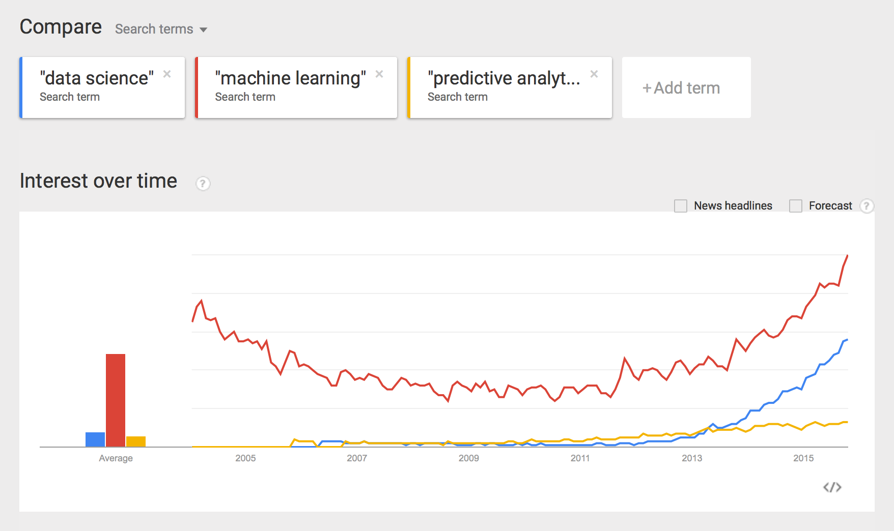

> # !!! UNDER CONSTRUCTION !!!
> (But open the book anyway, we're adding content...)


# Introduction to Data Science, Machine Learning & Predictive Analytics
- Overview
- What is Data Science?
- Data Science Tasks
  - Problem Formulation (motivation)
  - Collect & Process Data
  - Machine Learning
  - Insights & Action
- What is Machine Learning?
- Machine Learning Tasks
  - Regression
  - Classification (Binary and Multiclass)
  - Ranking
  - Clustering
  - Dimensionality Reduction
  - Feature Importance
- Data Science Pipelines

## Overview

This tutorial is designed to provide an introduction to concepts in the fields of data science and machine learning.  A shorter version of this content, designed for non-data scientists, is available as a [slidedeck](http://www.slideshare.net/0xdata/intro-to-data-science-for-nondata-scientists) from a previous H2O meetup.

## What is Data Science?

One of the earliest uses of the term "data science" occured in the title of the 1996 [ International Federation of Classification Societies (IFCS)](http://www.classification-society.org/ifcs/index.html) conference in Kobe, Japan. 


The term re-emerged and became popularized by [William Cleveland](http://www.stat.purdue.edu/~wsc/) (then at Bell Labs) when he published, "[Data Science: An Action Plan for Expanding the Technical Areas of the Field of Statistics.](http://www.stat.purdue.edu/~wsc/papers/datascience.pdf)" in 2001.  

This publication describes a plan to enlarge the major areas of technical work of the field of statistics.  Dr. Cleveland states, "Since plan is ambitious and implies substantial change, the altered field will be called “data science."  The plan sets out six technical areas for a university department and advocates a specific allocation of resources to research and development in each area as a percent of the total resources that are available beyond those needed to teach the courses in the department's curriculum.  Those areas are:
- Multidisciplinary Investigations
- Models and Methods for Data
- Computing with Data
- Pedagogy
- Tool Evaluation
- Theory

Since then, the use of the term has been rapidly increasing, with a sharp increase in use in the past few years (Google Trends for several terms):



Most recently, the term "data science" is used to describe an amalgamation of topics from a variety of technical fields (statistics, machine learning, computer science, engineering, visualization) that are concerned with data processing and learning from data.

More information on the history of the term "data science" is chronicled [here](http://whatsthebigdata.com/2012/04/26/a-very-short-history-of-data-science/).


## Data Science Tasks

Data science can also be defined by the processes that are required to solve problems.  Here is a summary of those major tasks:
- Problem Formulation
  - Identify an outcome of interest and the type of task (e.g. classification, regression)
  - Identify the potential predictor variables
  - Identify the independent sampling units
- Collect & Process Data
  - Conduct research experiment (e.g. Clinical Trial)
  - Collect examples / randomly sample the population
  - Transform, clean, impute, filter, aggregate data
  - Prepare the data for machine learning — X, Y
- Machine Learning
  - Modeling using a machine learning algorithm (training)
  - Model evaluation and comparison
  - Sensitivity & Cost Analysis
- Insights & Action
  - Translate results into action items
  - Feed results into research pipeline

## What is Machine Learning?

So, now that we have loosely defined the term, "data science", how do we define "machine learning"?

Here are a few definitions of machine learning by the experts.

What is machine learning?
```
"Field of study that gives computers the ability to learn without 
being explicitly programmed."

-- Arthur Samuel, 1959
```

Unlike rules-based systems which require a human expert to hard-code domain knowledge directly into the system, a machine learning algorithm learns how to make decisions from the data alone.


What is Machine Learning vs. Statistics?
```
"Machine learning and statistics are closely related fields. 
The ideas of machine learning, from methodological principles 
to theoretical tools, have had a long pre-history in statistics."  

"I personally don't make the distinction between statistics and 
machine learning..."

-- Michael I. Jordan, 2014
```
And to put it more bluntly...
```
"When Leo Breiman developed random forests, was he being a 
statistician or a machine learner? 

When my colleagues and I developed latent Dirichlet allocation, 
were we being statisticians or machine learners? 

Are the SVM and boosting machine learning while logistic 
regression is statistics, even though they're solving essentially 
the same optimization problems up to slightly different shapes in 
a loss function? 

Why does anyone think that these are meaningful distinctions?"

-- Michael I. Jordan, 2014
```
Michael I. Jordan also suggested the term "data science" as a placeholder to call the overall field.


## Machine Learning Tasks

There are a few concepts that you should become familiar with when first exploring machine learning.

- Training Data:
- Features:
- Models:
- Model Validation:
- Overfitting: ?
- Supervised Learning:
- Unsupervised Learning:

### Regression
Regression is the term for training a model to predict a real-valued response (e.g. weight, price, viral load)
... TO DO
### Classification (Binary and Multiclass)
TO DO
### Ranking
TO DO
### Clustering
TO DO
### Dimensionality Reduction
Dimension reduction can be useful when .... (TO DO)

There are several types of ways to reduce the dimensionality of your data, but you can divide them into two types of methods:  Feature Selection and Feature Extraction
#### Feature Selection
Feature selection is the process of selecting a subset of the original set of features from the dataset, usually with the intention of producing a better predicitve model by using the limited set of features instead of the original set.  Feature selection is also known by the names, "variable selection" or "variable subset selection".

In the age of Big Data, many noisy and/or useless variables are recorded and included in a training set.  If there are too many of these variables present, some algorithms will have a harder time finding the signal in the noise (i.e. producing a strong predictive model).

Here are a few common feature selection methods:
- Lasso Regression
- Forward and Backward Stepwise Regression
- Forward and Backward Stagewise Regression
- TO DO ...

#### Feature Extraction
Feature extraction is a general term to describe deriving new features from the original dataset.  This is usually performed in an effort to reduce the dimensionality of the data (reduce the number of features/columns).  The data transformation may be linear (as in PCA), or nonlinear.

Here are a few feature extraction methods:
- Principal Components Analysis (PCA)
- Linear Discriminant Analysis (LDA)
- Generalized Low Rank Models (GLRM)
- TO DO ...


### Feature Importance
- TO DO: Random Forest, GLM Coefficients, etc


## Data Science Pipelines


Data scientist built a black-box model.  Need a cluster to productionize model.  Network pipeline bringing data in (IT and Hardware involved)

TO DO: Add a slide about how this fits into the IT pipeline and business.


## References
[1] [https://www.reddit.com/r/MachineLearning/comments/2fxi6v/ama_michael_i_jordan/ckelmtt](https://www.reddit.com/r/MachineLearning/comments/2fxi6v/ama_michael_i_jordan/ckelmtt)

