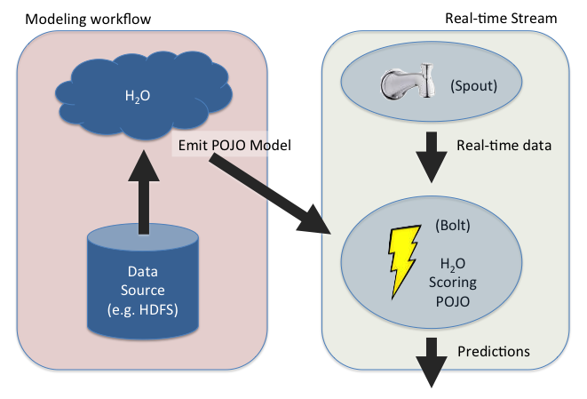
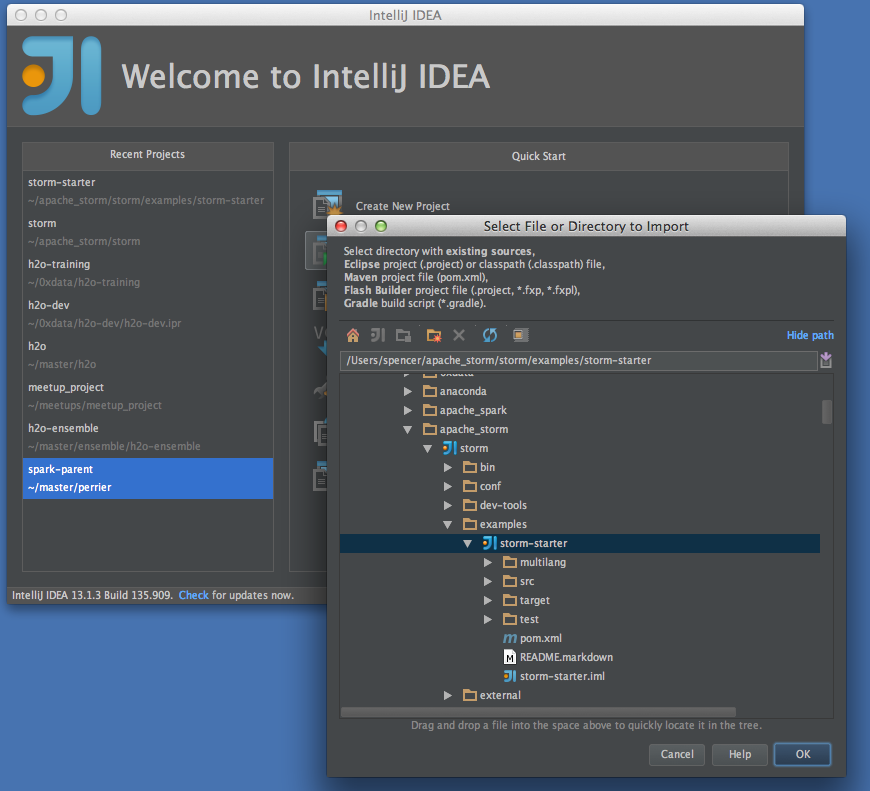
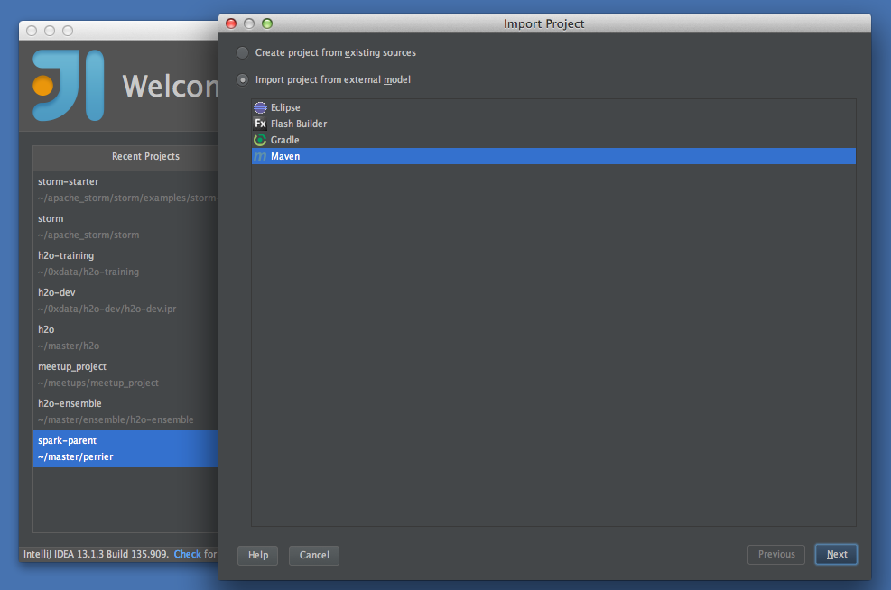
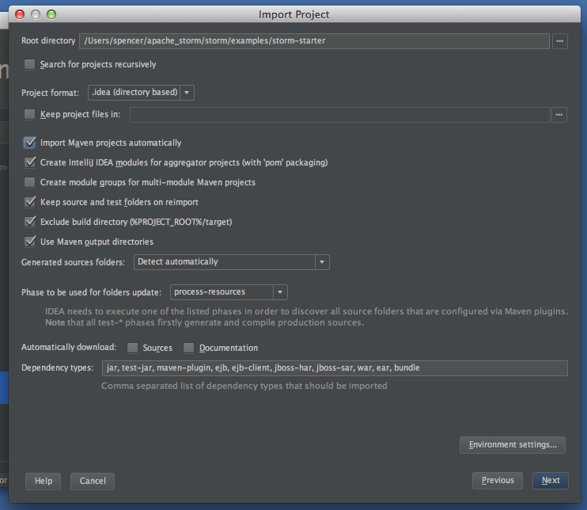
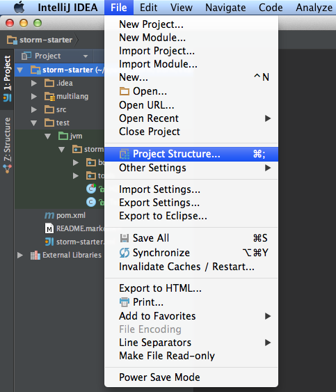
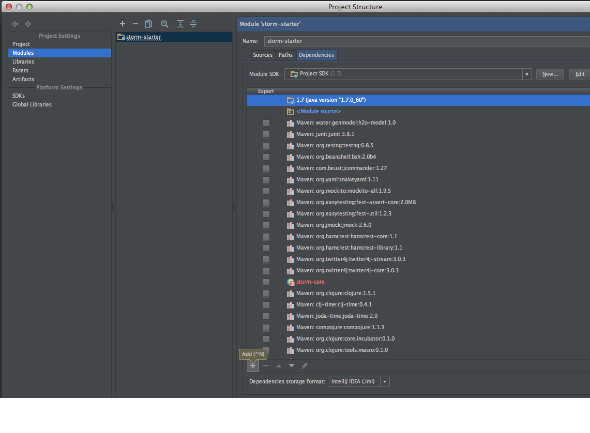
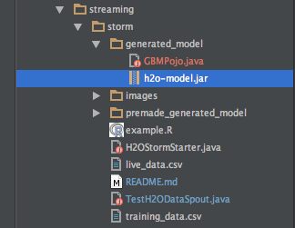
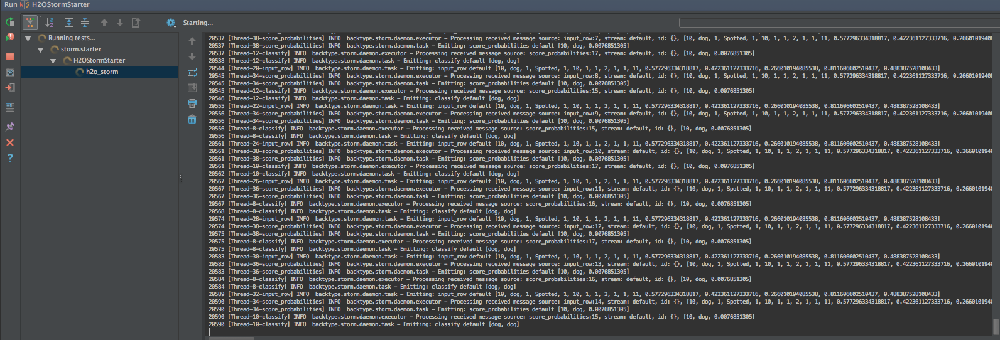

# Real-time Predictions With H2O on Storm

This tutorial shows how to create a [Storm](https://storm.apache.org/) topology can be used to make real-time predictions with [H2O](http://h2o.ai).

## 1.  What this tutorial covers

<br/>

In this tutorial, we explore a combined modeling and streaming workflow as seen in the picture below:



We produce a GBM model by running H2O and emitting a Java POJO used for scoring.  The POJO is very lightweight and does not depend on any other libraries, not even H2O.  As such, the POJO is perfect for embedding into third-party environments, like a Storm bolt.

This tutorial walks you through the following sequence:

*  Installing the required software
*  A brief discussion of the data
*  Using R to build a gbm model in H2O
*  Exporting the gbm model as a Java POJO
*  Copying the generated POJO files into a Storm bolt build environment
*  Building Storm and the bolt for the model
*  Running a Storm topology with your model deployed
*  Watching predictions in real-time

(Note that R is not strictly required, but is used for convenience by this tutorial.)


## 2.  Installing the required software

### 2.1.  Clone the required repositories from Github

```
git clone https://github.com/apache/storm.git 
git clone https://github.com/h2oai/h2o-world-2015-training.git
``` 

* *NOTE*: Building storm (c.f. [Section 5](#BuildStorm)) requires [Maven](http://maven.apache.org/). You can install Maven (version 3.x) by following the [Maven installation instructions](http://maven.apache.org/download.cgi).

Navigate to the directory for this tutorial inside the h2o-world-2015-training repository:

```
cd h2o-world-2015-training/tutorials/streaming/storm
```  

You should see the following files in this directory:

* **_README.md_** (This document)
* **_example.R_** (The R script that builds the GBM model and exports it as a Java POJO)
* **_training_data.csv_** (The data used to build the GBM model)
* **_live_data.csv_** (The data that predictions are made on; used to feed the spout in the Storm topology)
* **_H2OStormStarter.java_** (The Storm topology with two bolts:  a prediction bolt and a classifying bolt)
* **_TestH2ODataSpout.java_** (The Storm spout which reads data from the live_data.csv file and passes each observation to the prediction bolt one observation at a time; this simulates the arrival of data in real-time)

And the following directories:

* **_premade_generated_model_** (For those people who have trouble building the model but want to try running with Storm anyway; you can ignore this directory if you successfully build your own generated_model later in the tutorial)
* **_images_** (Images for the tutorial documentation, you can ignore these)
* **_web_** (Contains the html and image files for watching the real-time prediction output (c.f. [Section 8](#real_time)))


### 2.2.  Install R

Get the [latest version of R from CRAN](http://www.r-project.org/index.html) and install it on your computer.

### 2.3.  Install the H2O package for R

> Note:  The H2O package for R includes both the R code as well as the main H2O jar file.  This is all you need to run H2O locally on your laptop.

Step 1:  Start R (at the command line or via RStudio)   

Step 2:  Install H2O from CRAN  
```
install.packages("h2o")
``` 

Note:  For convenience, this tutorial was created with the [Slater](http://h2o-release.s3.amazonaws.com/h2o/rel-slater/3/index.html) stable release of H2O (3.2.0.3) from CRAN, as shown above.  Later versions of H2O will also work.

### 2.4.  Development environment

This tutorial was developed with the following software environment.  (Other environments will work, but this is what we used to develop and test this tutorial.)

* H2O 3.3.0.99999 (Slater)
* MacOS X (Mavericks)
* java version "1.7.0_79"
* R 3.2.2
* Storm git hash: 99285bb719357760f572d6f4f0fb4cd02a8fd389
* curl 7.30.0 (x86_64-apple-darwin13.0) libcurl/7.30.0 SecureTransport zlib/1.2.5
* Maven (Apache Maven 3.3.3)

For viewing predictions in real-time ([Section 8](#real_time)) you will need the following:

* npm (1.3.11)  (`brew install npm`)
* http-server   (`npm install http-server -g`)
* A modern web browser (animations depend on [D3](http://d3js.org/))


## 3.  A brief discussion of the data

Let's take a look at a small piece of the training_data.csv file for a moment.  This is a synthetic data set created for this tutorial.

```
head -n 20 training_data.csv
```  

| Label | Has4Legs | CoatColor | HairLength | TailLength | EnjoysPlay | StaresOutWindow | HoursSpentNapping | RespondsToCommands | EasilyFrightened | Age | Noise1             | Noise2             | Noise3              | Noise4             | Noise5             |
|-------|----------|-----------|------------|------------|------------|-----------------|-------------------|--------------------|------------------|-----|--------------------|--------------------|---------------------|--------------------|--------------------|
| dog   | 1        | Brown     | 0          | 2          | 1          | 1               | 2                 | 1                  | 0                | 4   | 0.852352328598499  | 0.229839221341535  | 0.576096264412627   | 0.0105558061040938 | 0.470826978096738  |
| dog   | 1        | Brown     | 1          | 1          | 1          | 1               | 5                 | 0                  | 0                | 16  | 0.928460991941392  | 0.98618565662764   | 0.553872474469244   | 0.932764369761571  | 0.435074317501858  |
| dog   | 1        | Grey      | 1          | 10         | 1          | 1               | 2                 | 1                  | 0                | 5   | 0.658247262472287  | 0.379703616956249  | 0.767817151267081   | 0.840509128058329  | 0.538852979661897  |
| dog   | 1        | Grey      | 1          | 1          | 1          | 1               | 2                 | 1                  | 1                | 2   | 0.210346511797979  | 0.912498287158087  | 0.757371880114079   | 0.915149037493393  | 0.27393517526798   |
| dog   | 1        | Brown     | 1          | 5          | 1          | 0               | 10                | 1                  | 0                | 20  | 0.770219849422574  | 0.999768516747281  | 0.482816896401346   | 0.904691722244024  | 0.232283475110307  |
| cat   | 1        | Grey      | 1          | 6          | 1          | 1               | 3                 | 0                  | 1                | 10  | 0.499049366684631  | 0.690937616396695  | 0.00580681697465479 | 0.516113663092256  | 0.161103375256062  |
| dog   | 1        | Spotted   | 1          | 1          | 1          | 1               | 2                 | 1                  | 1                | 17  | 0.980622073402628  | 0.193929805886     | 0.50500241224654    | 0.848579460754991  | 0.750856031663716  |
| cat   | 1        | Spotted   | 1          | 7          | 0          | 1               | 5                 | 0                  | 1                | 9   | 0.298585452139378  | 0.425832540960982  | 0.816698056645691   | 0.0246927759144455 | 0.692579888971522  |
| dog   | 1        | Grey      | 1          | 1          | 1          | 1               | 2                 | 1                  | 1                | 3   | 0.724013194208965  | 0.120883409865201  | 0.754467910155654   | 0.43663241318427   | 0.0592612794134766 |
| cat   | 1        | Black     | 0          | 7          | 0          | 1               | 5                 | 0                  | 1                | 5   | 0.849093642551452  | 0.0961945767048746 | 0.588080670218915   | 0.0478771082125604 | 0.211781785823405  |
| dog   | 1        | Grey      | 1          | 1          | 1          | 0               | 2                 | 0                  | 1                | 1   | 0.362678906414658  | 0.54775956296362   | 0.522148486692458   | 0.903857592027634  | 0.496479033492506  |
| dog   | 1        | Spotted   | 0          | 1          | 1          | 1               | 2                 | 1                  | 0                | 3   | 0.745238043367863  | 0.0181446429342031 | 0.33444849960506    | 0.550831729080528  | 0.625747208483517  |
| dog   | 1        | Spotted   | 1          | 4          | 1          | 1               | 2                 | 1                  | 0                | 20  | 0.693285189568996  | 0.69526576064527   | 0.386858200887218   | 0.235119538847357  | 0.401590927504003  |
| cat   | 1        | Spotted   | 1          | 8          | 1          | 1               | 3                 | 0                  | 0                | 3   | 0.695167713565752  | 0.81692309374921   | 0.530564708868042   | 0.081766308285296  | 0.277844901895151  |
| cat   | 1        | White     | 1          | 8          | 0          | 1               | 5                 | 0                  | 0                | 3   | 0.0237249641213566 | 0.867370987776667  | 0.855278167175129   | 0.284646768355742  | 0.566314383875579  |
| cat   | 1        | Black     | 1          | 5          | 1          | 1               | 2                 | 0                  | 1                | 16  | 0.281967194052413  | 0.798100406536832  | 0.306403951486573   | 0.681048742029816  | 0.237810888560489  |
| cat   | 1        | Grey      | 1          | 7          | 1          | 1               | 3                 | 1                  | 1                | 16  | 0.178538456792012  | 0.566589535912499  | 0.297640548087656   | 0.634627313353121  | 0.677242929581553  |
| cat   | 1        | Spotted   | 1          | 8          | 0          | 0               | 10                | 0                  | 1                | 3   | 0.219212393043563  | 0.482533045113087  | 0.739678716054186   | 0.132942436495796  | 0.100684949662536  |


Note that the first row in the training data set is a header row specifying the column names.

The response column (i.e. the "y" column) we want to make predictions for is Label.  It's a binary column, so we want to build a classification model.  The response column is categorical, and contains two levels, 'cat' and 'dog'.  Note that the ratio of dogs to cats is 3:1.

The remaining columns are all input features (i.e. the "x" columns) we use to predict whether each new observation is a 'cat' or a 'dog'.  The input features are a mix of integer, real, and categorical columns.


## 4.  Using R to build a gbm model in H2O and export it as a Java POJO

<a name="RPOJO"></a>
###  4.1.  Build and export the model

The `example.R` script builds the model and exports the Java POJO to the generated_model temporary directory.  Run `example.R` at the command line as follows:

```bash
R -f example.R  
```
You will see the following output:
```{r}

R version 3.2.2 (2015-08-14) -- "Fire Safety"
Copyright (C) 2015 The R Foundation for Statistical Computing
Platform: x86_64-apple-darwin13.4.0 (64-bit)

R is free software and comes with ABSOLUTELY NO WARRANTY.
You are welcome to redistribute it under certain conditions.
Type 'license()' or 'licence()' for distribution details.

  Natural language support but running in an English locale

R is a collaborative project with many contributors.
Type 'contributors()' for more information and
'citation()' on how to cite R or R packages in publications.

Type 'demo()' for some demos, 'help()' for on-line help, or
'help.start()' for an HTML browser interface to help.
Type 'q()' to quit R.

> #
> # Example R code for generating an H2O Scoring POJO.
> #
> 
> # "Safe" system.  Error checks process exit status code.  stop() if it failed.
> safeSystem <- function(x) {
+   print(sprintf("+ CMD: %s", x))
+   res <- system(x)
+   print(res)
+   if (res != 0) {
+     msg <- sprintf("SYSTEM COMMAND FAILED (exit status %d)", res)
+     stop(msg)
+   }
+ }
> 
> library(h2o)
Loading required package: statmod

----------------------------------------------------------------------

Your next step is to start H2O:
    > h2o.init()

For H2O package documentation, ask for help:
    > ??h2o

After starting H2O, you can use the Web UI at http://localhost:54321
For more information visit http://docs.h2o.ai

----------------------------------------------------------------------


Attaching package: ‘h2o’

The following objects are masked from ‘package:stats’:

    sd, var

The following objects are masked from ‘package:base’:

    %*%, %in%, apply, as.factor, as.numeric, colnames, colnames<-,
    ifelse, is.factor, is.numeric, log, range, trunc

> 
> cat("Starting H2O\n")
Starting H2O
> myIP <- "localhost"
> myPort <- 54321
> h <- h2o.init(ip = myIP, port = myPort, startH2O = TRUE)

H2O is not running yet, starting it now...

Note:  In case of errors look at the following log files:
    /var/folders/ct/mv0lk53d5lq6bkvm_2snjgm00000gn/T//RtmpkEUbAR/h2o_ludirehak_started_from_r.out
    /var/folders/ct/mv0lk53d5lq6bkvm_2snjgm00000gn/T//RtmpkEUbAR/h2o_ludirehak_started_from_r.err

java version "1.7.0_79"
Java(TM) SE Runtime Environment (build 1.7.0_79-b15)
Java HotSpot(TM) 64-Bit Server VM (build 24.79-b02, mixed mode)

..Successfully connected to http://localhost:54321/ 

R is connected to the H2O cluster: 
    H2O cluster uptime:         1 seconds 738 milliseconds 
    H2O cluster version:        3.3.0.99999 
    H2O cluster name:           H2O_started_from_R_ludirehak_dwh703 
    H2O cluster total nodes:    1 
    H2O cluster total memory:   3.56 GB 
    H2O cluster total cores:    8 
    H2O cluster allowed cores:  2 
    H2O cluster healthy:        TRUE 

Note:  As started, H2O is limited to the CRAN default of 2 CPUs.
       Shut down and restart H2O as shown below to use all your CPUs.
           > h2o.shutdown()
           > h2o.init(nthreads = -1)

> 
> cat("Building GBM model\n")
Building GBM model
> df <- h2o.importFile(path = normalizePath("./training_data.csv"));
  |======================================================================| 100%
> y <- "Label"
> x <- c("Has4Legs","CoatColor","HairLength","TailLength","EnjoysPlay","StaresOutWindow","HoursSpentNapping","RespondsToCommands","EasilyFrightened","Age", "Noise1", "Noise2", "Noise3", "Noise4", "Noise5")
> gbm.h2o.fit <- h2o.gbm(training_frame = df, y = y, x = x, model_id = "GBMPojo", ntrees = 10)
  |======================================================================| 100%
> 
> cat("Downloading Java prediction model code from H2O\n")
Downloading Java prediction model code from H2O
> model_id <- gbm.h2o.fit@model_id
> 
> tmpdir_name <- "generated_model"
> cmd <- sprintf("rm -fr %s", tmpdir_name)
> safeSystem(cmd)
[1] "+ CMD: rm -fr generated_model"
[1] 0
> cmd <- sprintf("mkdir %s", tmpdir_name)
> safeSystem(cmd)
[1] "+ CMD: mkdir generated_model"
[1] 0
> 
> h2o.download_pojo(gbm.h2o.fit, "./generated_model/")
[1] "POJO written to: ./generated_model//GBMPojo.java"
> 
> cat("Note: H2O will shut down automatically if it was started by this R script and the script exits\n")
Note: H2O will shut down automatically if it was started by this R script and the script exits
> 
```

### 4.2.  Look at the output

The generated_model directory is created and now contains two files:

`ls -l generated_model`  

```
ls -l generated_model/
total 72
-rw-r--r--  1 ludirehak  staff  19764 Sep 25 12:36 GBMPojo.java
-rw-r--r--  1 ludirehak  staff  23655 Sep 25 12:36 h2o-genmodel.jar
```

The h2o-genmodel.jar file contains the interface definition, and the GBMPojo.java file contains the Java code for the POJO model.

The following three sections from the generated model are of special importance.

####  4.2.1.  Class name

```
public class GBMPojo extends GenModel {
```

This is the class to instantiate in the Storm bolt to make predictions. 


####  4.2.2.  Predict method

```
public final double[] score0( double[] data, double[] preds )
```

score0() is the method to call to make a single prediction for a new observation.  **_data_** is the input, and **_preds_** is the output.  The return value is just **_preds_**, and can be ignored.

Inputs and Outputs must be numerical.  Categorical columns must be translated into numerical values using the DOMAINS mapping on the way in.  Even if the response is categorical, the result will be numerical.  It can be mapped back to a level string using DOMAINS, if desired.  When the response is categorical, the preds response is structured as follows:

```
preds[0] contains the predicted level number
preds[1] contains the probability that the observation is level0
preds[2] contains the probability that the observation is level1
...
preds[N] contains the probability that the observation is levelN-1

sum(preds[1] ... preds[N]) == 1.0
```

In this specific case, that means:

```
preds[0] contains 0 or 1
preds[1] contains the probability that the observation is ColInfo_15.VALUES[0]
preds[2] contains the probability that the observation is ColInfo_15.VALUES[1]
```


####  4.2.3.  DOMAINS array


```
  // Column domains. The last array contains domain of response column.
  public static final String[][] DOMAINS = new String[][] {
    /* Has4Legs */ null,
    /* CoatColor */ GBMPojo_ColInfo_1.VALUES,
    /* HairLength */ null,
    /* TailLength */ null,
    /* EnjoysPlay */ null,
    /* StaresOutWindow */ null,
    /* HoursSpentNapping */ null,
    /* RespondsToCommands */ null,
    /* EasilyFrightened */ null,
    /* Age */ null,
    /* Noise1 */ null,
    /* Noise2 */ null,
    /* Noise3 */ null,
    /* Noise4 */ null,
    /* Noise5 */ null,
    /* Label */ GBMPojo_ColInfo_15.VALUES
  };
```

The DOMAINS array contains information about the level names of categorical columns.  Note that Label (the column we are predicting) is the last entry in the DOMAINS array.

<a name="BuildStorm"></a>
## 5.  Building Storm and the bolt for the model

### 5.1 Build storm and import into IntelliJ
To build storm navigate to the cloned repo and install via Maven:

`cd storm && mvn clean install -DskipTests=true`  

Once storm is built, open up your favorite IDE to start building the h2o streaming topology. In this tutorial, we will be using [IntelliJ](https://www.jetbrains.com/idea/).

To import the storm-starter project into your IntelliJ please follow these screenshots:

Click on "Import Project" and find the storm repo. Select storm-starter and click "OK"  


Import the project from extrenal model using Maven, click "Next"  



Ensure that "Import Maven projects automatically" check box is clicked (it's off by default), click "Next"  


That's it! Now click through the remaining prompts (Next -> Next -> Next -> Finish).

Once inside the project, open up *storm-starter/test/jvm/storm.starter*. Yes, we'll be working out of the test directory.

### 5.2  Build the topology

The topology we've prepared has one spout TestH2ODataSpout and two bolts (a "Predict Bolt" and a "Classifier Bolt"). Please copy the pre-built bolts and spout into the *test* directory in IntelliJ. 

Edit L100 of H2OStormStarter.java so that the file path is: `PATH_TO_H2O_WORLD_2015_TRAINING/h2o-world-2015-training/tutorials/streaming/storm/web/out`

Likewise, edit L46 of TestH2ODataSpout.java so that the file path is: `PATH_TO_H2O_WORLD_2015_TRAINING/h2o-world-2015-training/tutorials/streaming/storm/live_data.csv`

Now copy.

`cp H2OStormStarter.java /PATH_TO_STORM/storm/examples/storm-starter/test/jvm/storm/starter/`  

`cp TestH2ODataSpout.java /PATH_TO_STORM/storm/examples/storm-starter/test/jvm/storm/starter/`  

Your project should now look like this:


## 6.  Copying the generated POJO files into a Storm bolt build environment

We are now ready to import the H2O pieces into the IntelliJ project. We'll need to add the *h2o-genmodel.jar* and the scoring POJO.

To import the *h2o-genmodel.jar* into your IntelliJ project, please follow these screenshots:

File > Project Structure…  


Click the "+" to add a new dependency  


Click on Jars or directories…  


Find the h2o-genmodel.jar that we previously downloaded with the R script in [section 4](#RPOJO)  


Click "OK", then "Apply", then "OK".

You now have the h2o-genmodel.jar as a dependency in your project.

Modify GBMPojo.java to add `package storm.starter;` as the first line.

`sed -i -e '1i\'$'\n''package storm.starter;'$'\n' ./generated_model/GBMPojo.java`
 
We now copy over the POJO from [section 4](#RPOJO) into our storm project.

`cp ./generated_model/GBMPojo.java /PATH_TO_STORM/storm/examples/storm-starter/test/jvm/storm/starter/`  

**_OR_** if you were not able to build the GBMPojo, copy over the pre-made version:

`cp ./premade_generated_model/GBMPojo.java /PATH_TO_STORM/storm/examples/storm-starter/test/jvm/storm/starter/`

If copying over the pre-made version of GBMPojo, also repeat the above steps in this section to import the pre-made *h2o-genmodel.jar* from the *premade_generated_model* directory.

Your storm-starter project directory should now look like this:


In order to use the GBMPojo class, our **_PredictionBolt_** in H2OStormStarter has the following "execute" block:


```
    @Override public void execute(Tuple tuple) {

      GBMPojo p = new GBMPojo();

      // get the input tuple as a String[]
      ArrayList<String> vals_string = new ArrayList<String>();
      for (Object v : tuple.getValues()) vals_string.add((String)v);
      String[] raw_data = vals_string.toArray(new String[vals_string.size()]);

      // the score pojo requires a single double[] of input.
      // We handle all of the categorical mapping ourselves
      double data[] = new double[raw_data.length-1]; //drop the Label

      String[] colnames = tuple.getFields().toList().toArray(new String[tuple.size()]);

      // if the column is a factor column, then look up the value, otherwise put the double
      for (int i = 1; i < raw_data.length; ++i) {
        data[i-1] = p.getDomainValues(colnames[i]) == null
                ? Double.valueOf(raw_data[i])
                : p.mapEnum(p.getColIdx(colnames[i]), raw_data[i]);
      }

      // get the predictions
      double[] preds = new double [GBMPojo.NCLASSES+1];
      //p.predict(data, preds);
      p.score0(data, preds);

      // emit the results
      _collector.emit(tuple, new Values(raw_data[0], preds[1]));
      _collector.ack(tuple);
    }
```


The probability emitted is the probability of being a 'dog'. We use this probability to decide whether the observation is of type 'cat' or 'dog' depending on some threshold. This threshold was chosen such that the F1 score was maximized for the testing data (please see AUC and/or h2o.performance() from R). 

The **_ClassifierBolt_** then looks like:

```
  public static class ClassifierBolt extends BaseRichBolt {
    OutputCollector _collector;
    final double _thresh = 0.54;

    @Override
    public void prepare(Map conf, TopologyContext context, OutputCollector collector) {
      _collector = collector;
    }

    @Override
    public void execute(Tuple tuple) {
      String expected=tuple.getString(0);
      double dogProb = tuple.getDouble(1);
      String content = expected + "," + (dogProb <= _thresh ? "dog" : "cat");
      try {
        File file = new File("/Users/ludirehak/other_h2o/h2o-world-2015-training/tutorials/streaming/storm/web/out");
        if (!file.exists())  file.createNewFile();
        FileWriter fw = new FileWriter(file.getAbsoluteFile());
        BufferedWriter bw = new BufferedWriter(fw);
        bw.write(content);
        bw.close();
      } catch (IOException e) {
        e.printStackTrace();
      }
      _collector.emit(tuple, new Values(expected, dogProb <= _thresh ? "dog" : "cat"));
      _collector.ack(tuple);
    }

    @Override
    public void declareOutputFields(OutputFieldsDeclarer declarer) {
      declarer.declare(new Fields("expected_class", "class"));
    }
  }
  ```

## 7.  Running a Storm topology with your model deployed

Finally, we can run the topology by right-clicking on H2OStormStarter and running. Here's a screen shot of what that looks like:



<a name="real_time"></a>
## 8.  Watching predictions in real-time


To watch the predictions in real time, we start up an http-server on port 4040 and navigate to [http://localhost:4040](http://localhost:4040).

In order to get http-server, install *npm* (you may need sudo):

`brew install npm`  
` npm install http-server -g`  

Once these are installed, you may navigate to the *web* directory and start the server:


`cd web`  
`http-server -p 4040 -c-1`  

Now open up your browser and navigate to [http://localhost:4040](http://localhost:4040). Requires a modern browser (depends on [D3](http://d3js.org/) for animation).  

Here's a [short video](https://www.youtube.com/watch?v=NTUo5MyS6qE) showing what it looks like all together.

Enjoy!

## References

* [CRAN](http://cran.r-project.org)
* GBM

    [The Elements of Statistical Learning. Vol.1. N.p., page 339](http://www.stanford.edu/~hastie/local.ftp/Springer/OLD//ESLII_print4.pdf)  
    Hastie, Trevor, Robert Tibshirani, and J Jerome H Friedman.  
    Springer New York, 2001.
    
    [Data Science with H2O (GBM)](http://docs.0xdata.com/datascience/gbm.html)
    
    [Gradient Boosting (Wikipedia)](http://en.wikipedia.org/wiki/Gradient_boosting)

* [H2O](http://h2o.ai)
* [H2O Markov stable release](http://h2o-release.s3.amazonaws.com/h2o/rel-markov/1/index.html)
* [Java POJO](http://en.wikipedia.org/wiki/Plain_Old_Java_Object)
* [R](http://www.r-project.org)
* [Storm](https://storm.apache.org)
